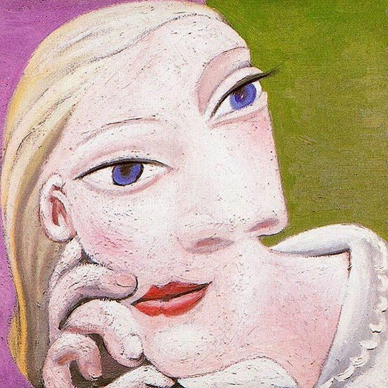

<section class="bl-hero">
  

    <h1>Babel Library</h1>
    
A truer present begins with reading.

  

</section>

<aside class="bl-bio" role="complementary" aria-label="About Scarlett">
  

    
    

      

        我是 Scarlett，一枚读者、新移民、游走于技术边缘的艺术家，
        一名关心他人与社会的思考者，一位试图把学术思考带入公共空间的局外人。欢迎来到这片小天地，共同坠入阅读的世界。
      

      

        Hi, I’m Scarlett — mostly a reader, sometimes a newcomer still figuring things out, occasionally an artist wandering at the edge of technology, and often just someone trying (and failing) to think seriously about the world. This little space is where I sneak academic curiosity into everyday life. Let’s get lost in reading together and find our way out.
      

    

  

</aside>

### 阅读书籍｜Reading as Art (We practice it every day) 
→ [每周书评 Weekly Bookreview](submit.md)

### 他者空间｜Toward the Other (Books in Community)
→ [加入社区 Join Community](join.md)

### 祛魅书籍｜Disenchanting the Book（History of Books/Reading） 
→ [爬梳学术 Academic Literature](disenchant/index.md)